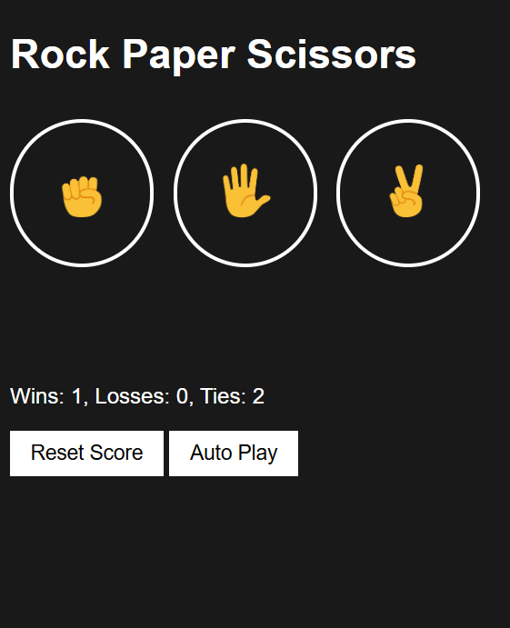

# 🪨📄✂️ Rock Paper Scissors Game

An interactive **Rock Paper Scissors** game built with **HTML, CSS, and JavaScript**.  
Play against the computer, track your score, and even let the game play itself with Auto Play mode! 🎮

---

## 🚀 Features
- 🎯 Play Rock, Paper, or Scissors against the computer
- 📊 Score tracking (Wins, Losses, Ties) saved in **localStorage**
- 🔁 Reset score with a confirmation prompt
- 🤖 **Auto Play mode** — game plays automatically every second until stopped
- ⌨️ Keyboard shortcuts:
  - `r` → Play Rock  
  - `p` → Play Paper  
  - `s` → Play Scissors  
  - `a` → Toggle Auto Play  
  - `Backspace` → Reset Score
- Responsive UI with styled buttons and emojis

---

## 🛠️ Tech Stack
- **HTML5**  
- **CSS3** (Flexbox layout & custom button styling)  
- **JavaScript (ES6)** — DOM manipulation, localStorage, and event handling  

---

## 📂 Project Structure
```
rock-paper-scissors/
├── index.html
├── rock-paper-scissors.css
├── rock-paper-scissors.js
└── images/
    ├── rock-emoji.png
    ├── paper-emoji.png
    └── scissors-emoji.png
```
---

## 📸 Preview
<p align="center">
  
</p>

---

## ▶️ Live Demo
Once deployed with GitHub Pages, you’ll be able to play here:  
👉 **https://krtyaka.github.io/rock-paper-scissors/**

---

## ⚡ How to Run Locally
1. Clone this repository:
   ```bash
   git clone https://github.com/Krtyaka/rock-paper-scissors.git
